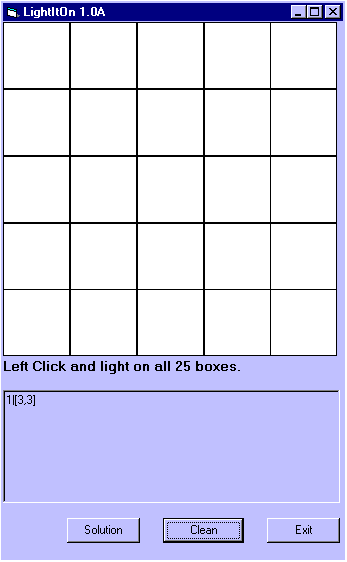



## LightItOn

### Description

This is a little mind (and math) game. You need to light a area of 5*5 boxes with a special figure. It may sound a little bit odd but don't worry: When you begin it's very easy!

The game also include a solution-finder. The solution finder simply runs through the combinations (total: 2^25=33554432) until it finds a solution.
 
### More Info
 
The source-code should be easy to understand and it also includes some god ideas if you are trying to make a chess(with a brain) game (arrays, "algoritm").

             |
---                |---
**Submitted On**   |2000-08-08 15:46:56
**By**             |[Henrik Sterner](https://github.com/Planet-Source-Code/PSCIndex/blob/master/ByAuthor/henrik-sterner.md)
**Level**          |Beginner
**User Rating**    |5.0 (20 globes from 4 users)
**Compatibility**  |VB 5\.0, VB 6\.0
**Category**       |[Games](https://github.com/Planet-Source-Code/PSCIndex/blob/master/ByCategory/games__1-38.md)
**World**          |[Visual Basic](https://github.com/Planet-Source-Code/PSCIndex/blob/master/ByWorld/visual-basic.md)
**Archive File**   |[CODE\_UPLOAD8746882000\.zip](https://github.com/Planet-Source-Code/henrik-sterner-lightiton__1-10518/archive/master.zip)

